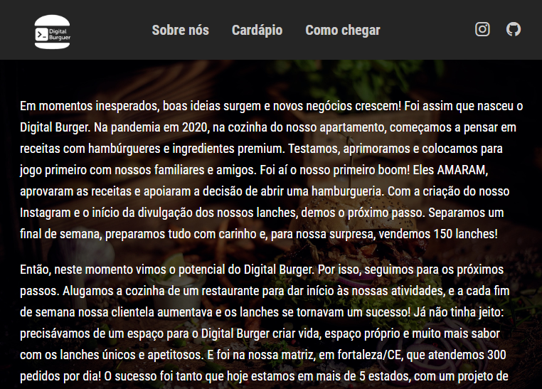

# Digital_Burger
Digital Burger um projeto para auxiliar as atividades de restaurantes, trazendo uma boa experiência e facilitação no atendimento.

  <a href="#-tecnologias">Tecnologias</a>&nbsp;&nbsp;&nbsp;|&nbsp;&nbsp;&nbsp;
  <a href="#-projeto">Projeto</a>&nbsp; | &nbsp;&nbsp;&nbsp;
  <a href="#-telas">Telas</a>

 
<h2>Scanear QR code para ver o site completo</h2>

 

## Tecnologias usadas 

Esse projeto foi desenvolvido com as seguintes tecnologias:

## Mais sobre o Projeto

Cardápio online da digital burger para o auxilio dos clientes e funcionarios agilizando o atendimento.

## Telas

### Cardápio

 
 
 

### Quem somos

 
 
 

### Login

## Proposto pela Digital college um cardápio online.

Catalógo de produtos separados por categorias, permitindo que o cliente possa ter o conforto visual e praticidade na hora de solicitar seu pedido.
Contém tambem opções de escolhas para alergicos onde o cliente pode detalhar cada produto e o modo de seu preparo.

